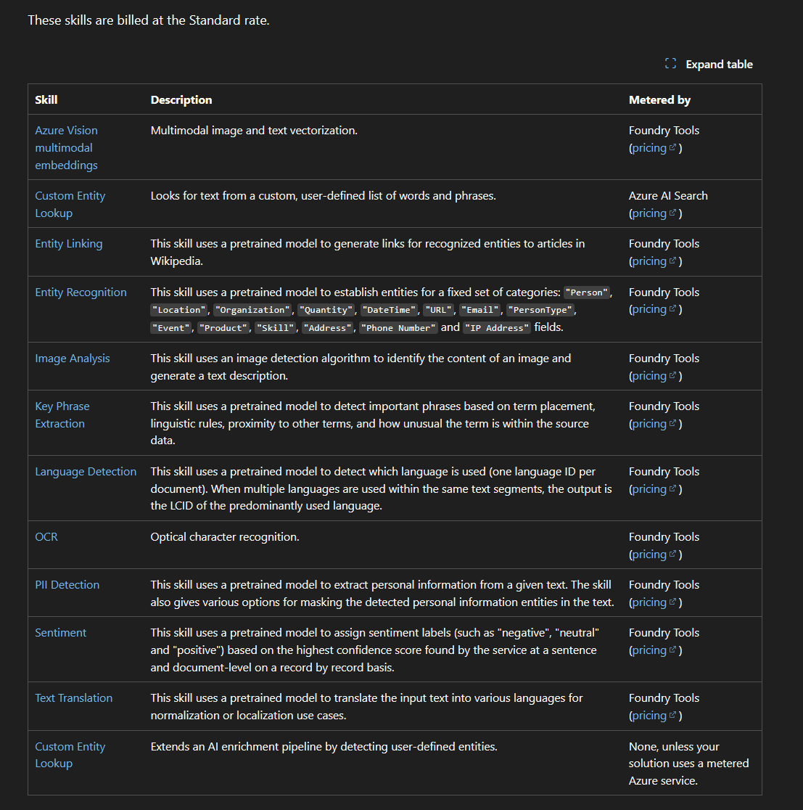

### Skillset - AI Search Ingestion Pipeline - Customization



```python

{
    "skills": [
        {
            "@odata.type": "#Microsoft.Skills.Text.SplitSkill",
            "name": "#1",
            "description": null,
            "context": "/document/reviews_text",
            "defaultLanguageCode": "en",
            "textSplitMode": "pages",
            "maximumPageLength": 5000,
            "inputs": [
                {
                    "name": "text",
                    "source": "/document/reviews_text"
                }
            ],
            "outputs": [
                {
                    "name": "textItems",
                    "targetName": "pages"
                }
            ]
        },
        {
            "@odata.type": "#Microsoft.Skills.Text.SentimentSkill",
            "name": "#2",
            "description": null,
            "context": "/document/reviews_text/pages/*",
            "defaultLanguageCode": "en",
            "inputs": [
                {
                    "name": "text",
                    "source": "/document/reviews_text/pages/*",
                }
            ],
            "outputs": [
                {
                    "name": "sentiment",
                    "targetName": "sentiment"
                },
                {
                    "name": "confidenceScores",
                    "targetName": "confidenceScores"
                },
                {
                    "name": "sentences",
                    "targetName": "sentences"
                }
            ]
        }
      . . .
  ]
}
```

Vector embedding Skill
```json
{
  "@odata.type": "#Microsoft.Skills.Text.AzureOpenAIEmbeddingSkill",
  "description": "Connects a deployed embedding model.",
  "resourceUri": "https://<your-domain-for-embed-model>.openai.azure.com/",
  "deploymentId": "my-text-embedding-3",
  "modelName": "text-embedding-3",
  "dimensions": 1536,
  "inputs": [
    {
      "name": "text",
      "source": "/document/content"
    }
  ],
  "outputs": [
    {
      "name": "contentVector"
    }
  ]
}
```

### Complete Python Example, uses Skillsets

https://github.com/Azure/azure-search-vector-samples/blob/main/demo-python/code/integrated-vectorization/azure-search-integrated-vectorization-sample.ipynb